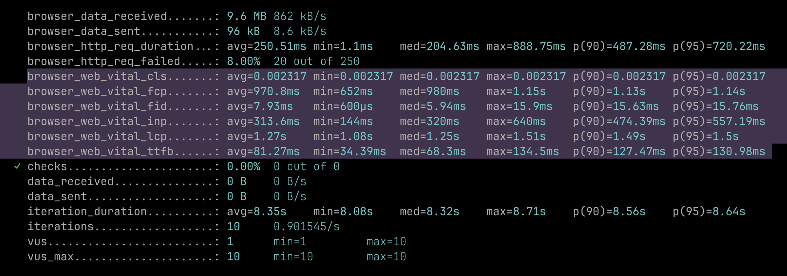
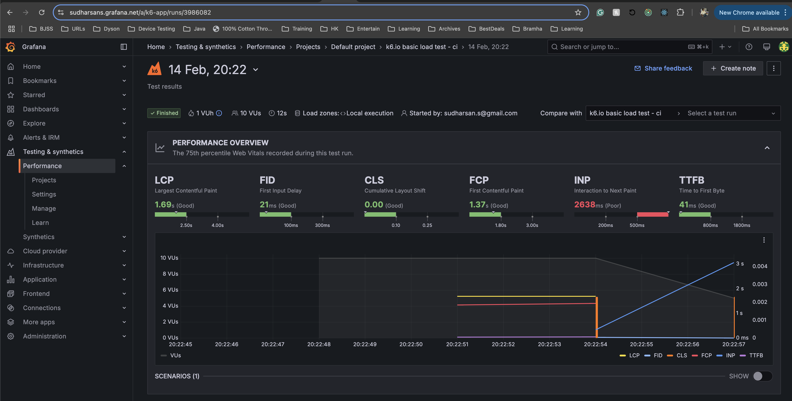

# Performance Profiling tests

These tests measure web app performance metrics during simulated user journeys.  Using k6, they concurrently run user flows against a target URL (e.g., https://www.saucedemo.com/), capturing Web Vitals:

Largest Contentful Paint (LCP)
First Input Delay (FID)
Cumulative Layout Shift (CLS)
First Contentful Paint (FCP)
Interaction to Next Paint (INP)
Time to First Byte (TTFB)
Tests can be executed locally, with metrics displayed in the console, or locally with metrics sent to Grafana k6 Cloud for analysis and comparison across runs.  Grafana k6 Cloud facilitates performance regression identification.

## Prerequisites
- k6, latest version

## Preparation
1. Access the web app under test. Ensure that your network allows access to https://www.saucedemo.com/

2. Install k6
```bash
brew install k6
```

3. (Optional) For cloud reporting, create a Grafana k6 Cloud account and obtain your API token.

## Running the tests

1. Local Execution (Console Output)
```bash
unset K6_CLOUD_API_TOKEN
unset K6_CLOUD_PROJECT_ID
k6 run performance-profiling-tests.js
```

2. Local Execution (Grafana k6 Cloud Output)
```bash
export K6_CLOUD_API_TOKEN=<Your grafanna k6 cloud Token>
export K6_CLOUD_PROJECT_ID=<Your grafanna k6 cloud project Id>  # Welcome to use mine 3747395
k6 run performance-profiling-tests.js --out cloud
```

After running the cloud test, k6 will output a report URL similar to https://sudharsans.grafana.net/a/k6-app/runs/3989499.  Use this URL to view the test results in your Grafana k6 Cloud dashboard.

## Interpreting Test Reports
k6 generates clear and concise performance reports.

Local Report Example:

_Highlighted the profiling metrics and their stats for reference._


Grafana k6 Cloud Report:

Test report in grafana dashbaord looks like this.

